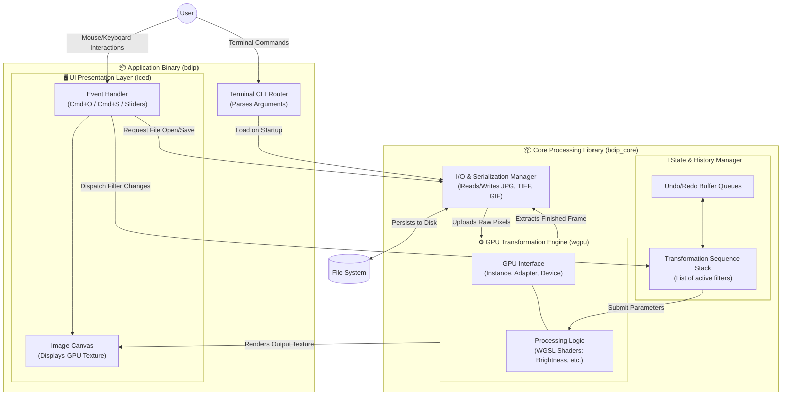

# Architectural Component Diagram

The following diagram provides a top-down view of the strict module separation inside the `bdip` workspace. It illustrates the data boundary isolating the **Application Binary (UI & CLI routing)** from the **Core Processing Library (GPU execution & Data I/O)**.

