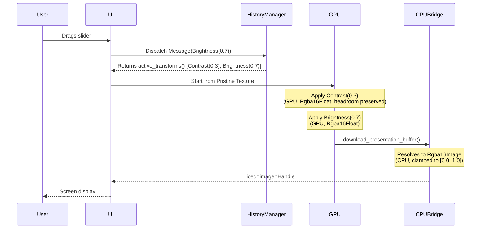

# Execution Model

This document outlines the step-by-step execution lifecycle of the `bdip` engine. It details how user interactions map to the GPU pipeline, where data resides throughout the process, and how precision is maintained between edits.

## 1. Transformation Execution Lifecycle

The lifecycle of an editing session is broken down into three distinct phases:

### 1a. Initialization (Once per image)
- The user opens a file (via UI picker or CLI argument).
- `io::load_image()` decodes the file into an `Rgba16Image` on the CPU.
- `upload_texture()` converts the CPU buffer to `Rgba16Float` and uploads it to the GPU as the **Pristine Texture**.
- The Pristine Texture remains on the GPU for the entire editing session and is **never modified**.

### 1b. Interactive Editing (Many times per session)
- Each user interaction (slider drag, undo, redo) triggers a **full pipeline execution** (see Section 2).
- The result is read back to the CPU via `download_presentation_buffer()` and handed to the UI for display.
- The Pristine Texture on the GPU is unchanged — only the *output* texture is regenerated.

### 1c. Finalization (Once per save)
- The user saves the file.
- The current pipeline result (already in CPU memory as `Rgba16Image` from the last readback) is passed to `io::save_image()`.
- Format-specific handling applies (e.g., JPEG/GIF downsample to 8-bit; PNG/TIFF preserve 16-bit).

## 2. Pipeline Execution Model ("Clean Slate Replay")

Inside each interactive edit, `bdip` employs a "Clean Slate Replay" approach. 

**Why replay the entire stack?**
- The GPU internal format (`Rgba16Float`) supports values above 1.0 — this is "headroom" that prevents precision loss when chaining transforms (e.g., Brightness +0.8 → Brightness -0.8 recovers the original value, not a clamped version).
- If we downloaded intermediate results to the CPU and re-uploaded them, the `download_presentation_buffer` clamping boundary would destroy headroom after every single transform.
- Therefore, we always start from the Pristine Texture and apply the *entire* active transformation stack in one GPU pass.
- This also makes undo/redo trivial: just pop/push the transform stack and re-execute.


**The readback clamping boundary**
- `download_presentation_buffer()` maps `Rgba16Float` → `Rgba16Image` (unorm u16), clamping values to [0.0, 1.0].
- This is intentional: the monitor cannot display values above 1.0, and standard file formats store normalized values.
- Headroom exists **only** within the GPU pipeline between transforms. It is consumed and resolved before the data leaves the GPU.

## 3. Slider & History Semantics

A critical element of the interactive experience is how the UI parameters map to the internal `HistoryManager` during "Clean Slate Replay" pipeline execution.

### 3a. Absolute Values over Deltas
**History stores absolute slider values.** Each slider release pushes the exact current slider position as an absolute value to `HistoryManager`. Releasing a Brightness slider at `0.7` records `Brightness(0.7)`, not a relative delta from the previous release. This is crucial mathematically: non-additive shaders (like Saturation) multiply values; tracking deltas leads to compound multiplication mismatches vs the absolute slider state viewed by the user.

### 3b. Collapsing Adjacent Runs
Before applying transforms to the GPU, the raw history is **collapsed**: consecutive entries of the same type are reduced to the last entry in each run. The raw history remains the granular source of truth for step-by-step undo/redo, but the collapsed list is exclusively what executes on the GPU.
```
Raw History:        [B(0.3), B(0.7), S(0.5), S(0.3), B(0.1)]
Collapsed Pipeline: [B(0.7), S(0.3), B(0.1)]
```

### 3c. Live Previews vs. History Push
- **On Slider Drag (Live Preview):** The UI enters an ephemeral `is_previewing` state. The collapsed history stack is fetched, and if the final item shares a type with the actively dragging slider, it is temporarily overriding it. The pipeline executes this draft list immediately to update the canvas. The newly sliding values are **not** pushed to the `HistoryManager`.
- **On Slider Release (Commit):** The slider drop finalizes the sequence. The UI exits `is_previewing`, pushes the absolute transform record to the `HistoryManager` as a permanent step, and triggers one final "Clean Slate Replay" pass to cement the result.
- **Slider Resets on Interrupts:** Sliders always preserve and display their committed position when released. They only reset to `0.0` when the user switches to a *different* transform type that disrupts the trailing position of the active stack, rendering previous coordinate adjustments contextually irrelevant.

## 4. Interactive Preview Strategy

This defines the rendering modes and when each is used:

**Full Resolution (Current V1 implementation)**
- Every interaction triggers the pipeline at the original image resolution.

## 5. Interactive Editing Loop

The diagram below illustrates the exact data flow during a live slide manipulation, accounting for the ephemeral `is_previewing` injection logic.


